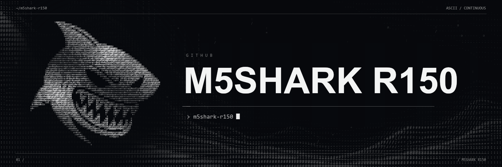

# M5SHARK R150

[](https://m5shark.com/products/m5shark-marauder-v8)

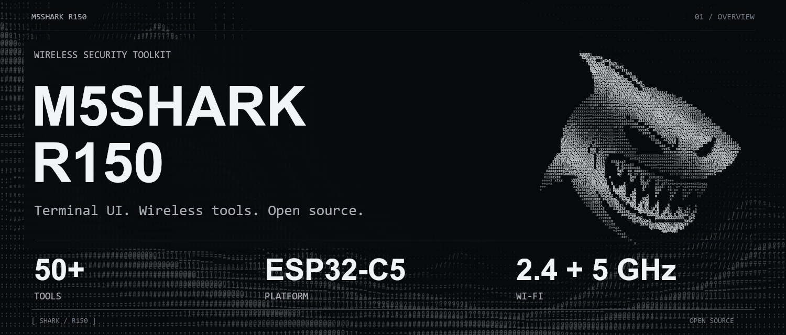

A hand-held wireless security testing device built on the ESP32-C5, running the SHARK firmware with terminal UI, theme engine, and 50+ tools.

  

> **Get the device:** [m5shark.com/products/m5shark-marauder-v8](https://m5shark.com/products/m5shark-marauder-v8)

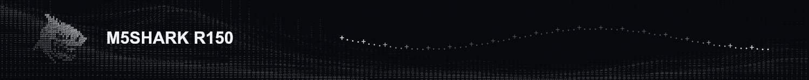

## Hardware

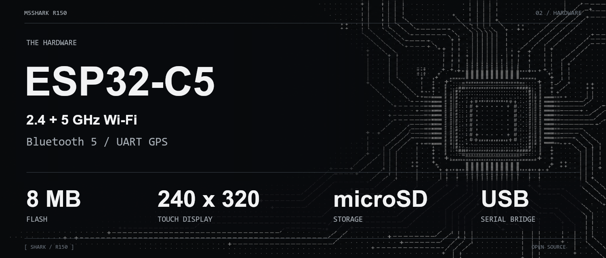

| Component | Specification |
|---|---|
| MCU | ESP32-C5 (RISC-V dual-core) |
| Flash | 8 MB (custom `shark_8mb` partition: 2× 3.6 MB OTA slots + 1.1 MB SPIFFS) |
| RAM | PSRAM enabled |
| Display | 240×320 ILI9341-class resistive touch, 40 MHz SPI |
| Radio | Wi-Fi 2.4+5 GHz / Bluetooth 5 (NimBLE) |
| GPS | UART module with external antenna (u.FL/SMA) |
| Storage | microSD (FAT32, dedicated SPI) |
| Battery | IP5306 power management (I²C) |
| USB | CH340 serial bridge for flashing + console |

### 3D Printable Case

STL files for the M5SHARK enclosure are in [`hardware/m5shark-v8-3d-case-stl.rar`](hardware/m5shark-v8-3d-case-stl.rar).


## Features

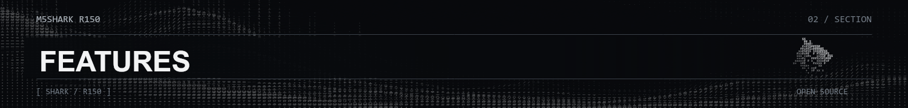

### Wi-Fi Tools

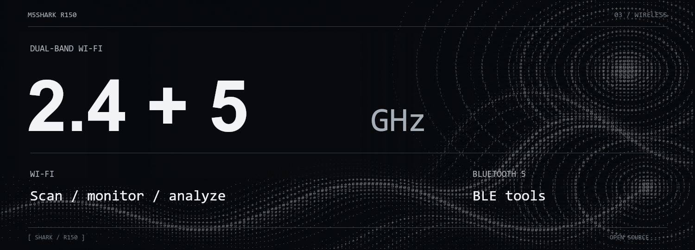

- **Scan AP** — active dual-band survey (2.4+5 GHz, hidden networks), per-network detail (SSID, channel+band, security type, RSSI bar, OPEN flagged), tap-to-select targets for attacks
- **Wardrive** — WiGLE-format CSV logging (Wi-Fi + BLE rows), works without GPS fix (0-coords until lock), TAG POI marker, SURVEY LOG dashboard, GPX POI files
- **MAC Monitor** — top-talker device tracking (WiFi + BLE), follow marker, amber highlight
- **Beacon/Probe/EAPOL/Deauth sniffers** — PCAP capture to SD
- **Packet Monitor** — live per-type bar graphs (MGMT/DATA/CTRL)
- **Channel Analyzer** — auto-sweep spectrum, busy-channel ranking
- **Pineapple Watch** / **Multi-SSID Watch** — rogue AP detection
- **Attacks** — beacon spam, auth rush, deauth, CSA, evil portal (authorized targets only)

### Bluetooth Tools

- **Sniffers** — FindMy Sniff/Monitor, Flipper, Flock, Meta Detect, Card Skimmers, Bluetooth Analyzer, Fox Hunt
- **Attacks** — Sour Apple, Apple Juice, Swiftpair, Samsung, Google, Flipper, Spam All, Spoof Airtag (deinit-free, MAC rotation at runtime)
- **BLE crash guard** — if BLE init ever crashes, next boot locks BLE out (auto-recovers after 5 clean boots)

### BadUSB Suite (over BLE)

Eight tools: SD payload picker (Ducky scripts), type text, self-test, Win recon, Win Wi-Fi keys, Linux recon, parameterized bash reverse shell, lock target. Free modifier combos (`CTRL-ALT t`, `GUI SHIFT s`).

### GPS Tools

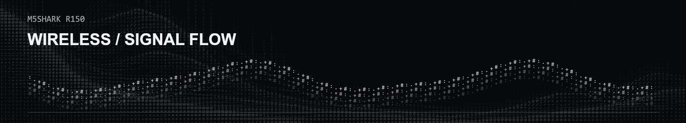

- **GPS Data** — fix pill (READY/NO FIX/NO ANT), SIGNALS + BEST dB live signal meter (GSV parsed), position panel, ANTENNA OPEN warning, animated SEARCHING counter
- **GPX Tracker** — one track point per second while fix exists
- **Wardrive integration** — coordinates auto-populate on lock

### Chameleon Ultra Remote

Full BLE central link with auto-connect/auto-reconnect. Nordic UART Service (verified from CU firmware source). Dashboard (version/mode/battery/slot), mode toggle, slot switching (1-8), READ HF (ISO14443-A UID/ATQA/SAK), READ LF (EM4100), EMULATE HF/LF (MIFARE Classic 1K / EM4100 on active slot).

### SSID Generator

Count steppers (10-2000), presets, GENERATE random names, ADD SSID via touch keyboard, CLEAR list. Feeds Beacon Spam / Probe Flood / Evil Portal.

### Web Control

Browser dashboard over the device's AP: live scan results, attack control, SD file manager, Evil Portal HTML management, wardrive log download, wallpaper upload.

### Theme Engine

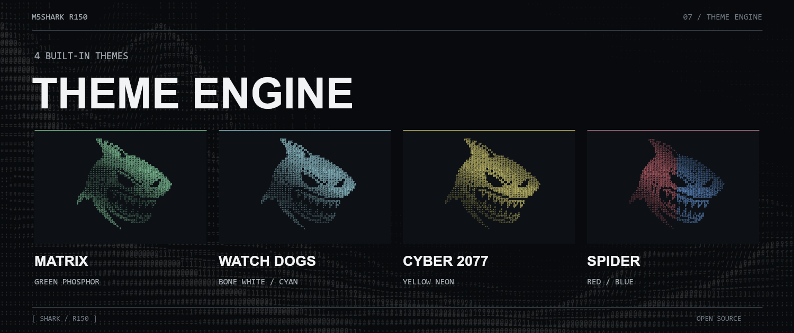

Four themes: **Matrix** (green phosphor, default), **Watch Dogs** (bone white + cyan), **Cyber 2077** (yellow neon), **Spider** (red/blue). NVS-persisted, splash art matches active theme.


## Flashing

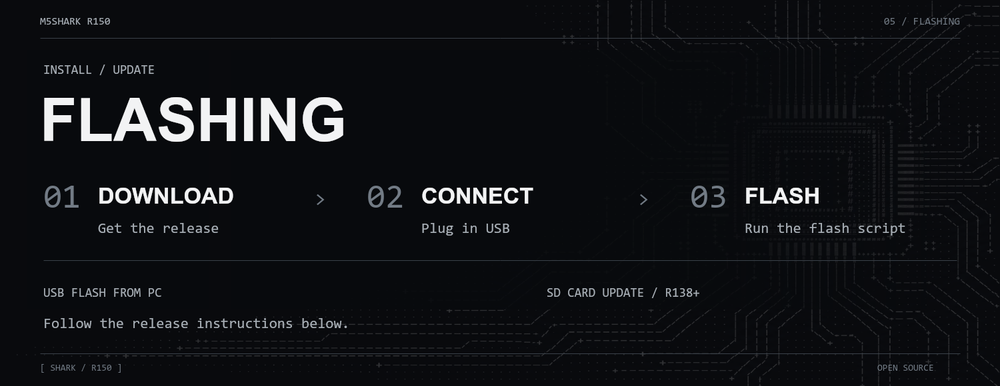

### USB flash from PC (recommended)

Download a flash kit from [Releases](https://github.com/M5Shark/M5SHARK/releases), extract, then:

```powershell
cd <extracted folder>
powershell -ExecutionPolicy Bypass -File ".\flash-full-fast.ps1" -Port COM6
```

Replace `COM6` with your device's port (Device Manager → Ports).

- If it won't connect: **hold BOOT, tap RESET, release after 2 seconds**, then retry
- If the write cuts out: add `-Baud 460800`
- Wait for **"WRITE COMPLETED"** in green, then **press RESET**

### SD card update (no PC, R138+ only)

Copy `update.bin` to the SD card root → Card Control → Update Firmware → select the file. A live progress bar and percentage counter runs during the write.

> **Important:** R138 changed the partition table (bigger 3.6 MB OTA slots). Devices on R137 or older must be updated over USB with a **full flash** (not `-Quick`, not SD update).


## Serial CLI

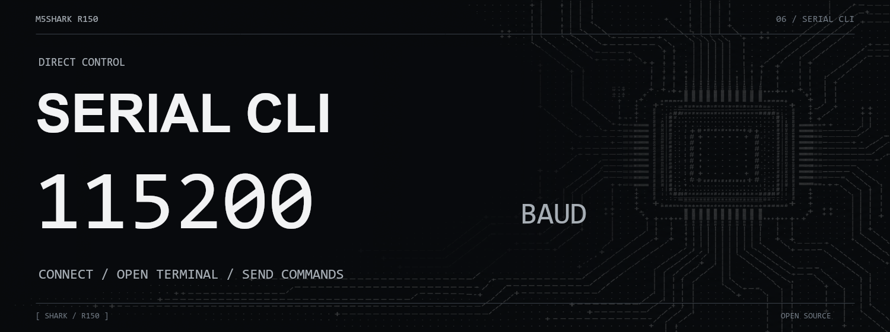

Connect via any terminal (PuTTY, Arduino Serial Monitor) at 115200 baud:

```
help                              full command list
wardrive                          start wardrive
sniffbt                           Bluetooth scan all
sniffbt -t airtag/flipper/flock/meta   targeted passive sniffs
blespam -t sourapple/all          BLE advertising attacks
gpsdata                           full GPS block (fix, sats, antenna, position)
nmea                              raw NMEA stream (antenna status visible)
stopscan                          stop the running tool
reboot                            restart
cleardevice                       factory-clear settings
```


## Building from source

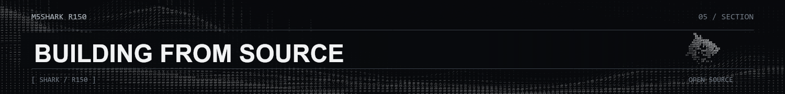

```bash
powershell -ExecutionPolicy Bypass -File build-shark-v8.ps1
```

The build uses:
- Arduino ESP32 core 3.3.4 (isolated config: `arduino-cli-esp32-3.3.4.yaml`)
- NimBLE-Arduino 2.5.1 (vendored in `.build-libraries/`)
- TFT_eSPI (vendored, User_Setup.h pins validated by the build script)
- Custom `shark_8mb` partition layout (`m5shark/partitions.csv`)


## Architecture

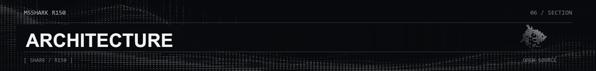

```
m5shark/
├── m5shark.ino          # main setup/loop, boot trace, splash
├── configs.h            # hardware pin map, display geometry, feature flags
├── WiFiScan.cpp/.h      # all Wi-Fi scanning, attacks, wardrive, CLI helpers
├── MenuFunctions.cpp/.h # menu system, all dashboards, touch handling
├── SharkUI.cpp/.h       # boot splash (skull morph + DedSec), idle wallpaper
├── SharkTheme.cpp/.h    # 4-theme engine with NVS persistence
├── SharkWeb.cpp/.h      # Web Control AP + browser dashboard
├── SharkPrank.cpp/.h    # WiFi + BLE prank suite (monkey, portals, hunts)
├── SharkChameleon.cpp/.h # Chameleon Ultra BLE remote
├── BadUsb.cpp/.h        # BLE BadUSB suite (8 tools, Ducky engine)
├── SharkIceNav.cpp/.h   # GPS navigation radar
├── Display.cpp/.h       # display primitives, touch, scan cards
├── CommandLine.cpp/.h   # serial CLI
├── GpsInterface.cpp/.h  # GPS UART + GSV signal meter
├── SDInterface.cpp/.h   # SD card + firmware update
└── ...                  # EvilPortal, WdgResponse, buffer, settings, etc.
```


## Troubleshooting

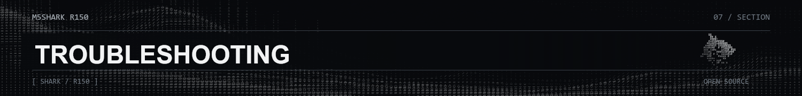

| Symptom | Cause | Fix |
|---|---|---|
| Boot-loops on splash (R117/R118 era) | Bad BLE library linked at build | Flash R150 (full flash) |
| BLUETOOTH LOCKED notice | BLE init crashed once; guard engaged | Auto-recovers after 5 clean boots |
| Flash won't connect | Auto-reset missed bootloader | Hold BOOT, tap RESET, release after 2 s |
| Write interrupted | USB dropout mid-write | Run same command again |
| Screen dark after flash | Chip waiting for reset | Press RESET once |
| GPS stays NO FIX / NO ANT | Antenna circuit open or weak sky view | Reseat antenna; watch SIGNALS/BEST dB outdoors |
| Wardrive logs 0,0 coords | No GPS fix yet (by design) | Coords fill in once receiver locks |
| Old-style screen flashes | Pre-R132 firmware | Update to R150 |


## Version history

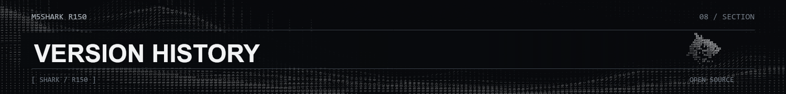

Key milestones:
- **R119** — splash boot-loop fixed (BLE crash guard)
- **R120-121** — BadUSB suite + control fixes
- **R122** — Wardrive SHARK dashboard
- **R126** — Wardrive works without GPS fix
- **R128** — MAC Monitor dashboard
- **R129** — SSID Generator
- **R132** — no legacy UI flash on any tool
- **R134** — 40 MHz display (2× speed)
- **R138** — GPS Tracker + bigger OTA slots (3.6 MB)
- **R141** — GPS BEST dB signal meter
- **R142** — Scan AP active survey
- **R143** — Matrix green default theme
- **R144-150** — Chameleon Ultra remote (auto-connect, NUS, emulation)


## Legal

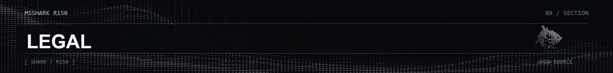

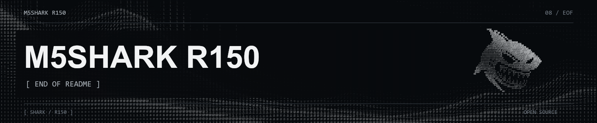

Licensed under GPL-3.0. See [LICENSE](LICENSE).

**Authorized testing only.** Use this firmware only on networks, devices, and systems you own or are explicitly permitted to test. You are responsible for complying with the laws that apply where you operate it.

[Get M5SHARK](https://m5shark.com/products/m5shark-marauder-v8)
